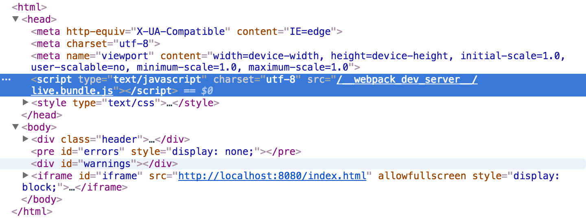
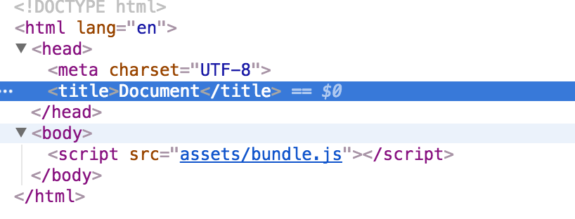
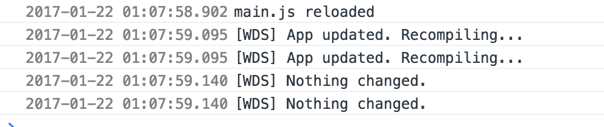

如果你想深入了解webpack-dev-server的内部原理，你可以查看我写的[这个打包工具](https://github.com/liangklfangl/wcf)，通过它可以完成三种打包方式，其中devServer模式就是通过webpack-dev-server来完成的，并且支持HMR。对于webpack的HMR不了解的可以[查看这里](https://github.com/liangklfangl/webpack-hmr)。其中也牵涉到[webpack-dev-middleware中间件](https://github.com/liangklfang/webpack-dev-middleware)。如果觉得有用，记得start哦~

### 1.webpack-dev-server配置

#### 1.1 ContentBase

webpack-dev-server会使用当前的路径作为请求的资源路径(所谓`当前的路径`就是你运行webpack-dev-server这个命令的路径，如果你对webpack-dev-server进行了包装，比如[wcf](https://github.com/liangklfangl/wcf),那么当前路径指的就是运行wcf命令的路径,一般是项目的根路径)，但是你可以通过指定content base来修改这个默认行为:

```js
$ webpack-dev-server --content-base build/
```

这样webpack-dev-server就会使用`build目录`下的资源来处理静态资源的请求，比如`css/图片等`。content-base一般不要和publicPath,output.path混淆掉。其中content-base表示`静态资源`的路径是什么,比如下面的例子:
```html
<!DOCTYPE html>
<html>
<head>
  <title></title>
  <link rel="stylesheet" type="text/css" href="index.css">
</head>
<body>
  <div id="react-content">这里要插入js内容</div>
</body>
</html>
```
在作为html-webpack-plugin的template以后，那么上面的`index.css`路径到底是什么?是相对于谁来说?上面我已经强调了:如果在没有指定content-base的情况下就是相对于`当前路径`来说的，所谓的当前路径就是在运行webpack-dev-server目录来说的，所以假如你在项目根路径运行了这个命令，那么你就要保证在项目根路径下存在该index.css资源，否则就会存在html-webpack-plugin的404报错。当然，为了解决这个问题，你可以将content-base修改为和html-webpack-plugin的html模板一样的目录。

上面讲到content-base只是和静态资源的请求有关，那么我们将其和`publicPath`和`output.path`做一个区分:

首先:假如你将output.path设置为`build`(这里的build和content-base的build没有任何关系，请不要混淆),你要知道webpack-dev-server实际上并没有将这些打包好的bundle写到这个目录下，而是存在于内存中的，但是我们可以`假设`(注意这里是假设)其是写到这个目录下的

然后：这些打包好的bundle在被请求的时候，其路径是相对于你配置的`publicPath`来说的，因为我的理解publicPath相当于虚拟路径，其映射于你指定的`output.path`。假如你指定的publicPath为 "/assets/",而且output.path为"build",那么相当于虚拟路径"/assets/"对应于"build"(前者和后者指向的是同一个位置)，而如果build下有一个"index.css"，那么通过虚拟路径访问就是`/assets/index.css`。

最后:如果某一个内存路径(文件写在内存中)已经存在特定的bundle，而且编译后内存中有新的资源，那么我们也会使用新的内存中的资源来处理该请求，而不是使用旧的bundle!比如我们有一个如下的配置:
```js
module.exports = {
  entry: {
    app: ["./app/main.js"]
  },
  output: {
    path: path.resolve(__dirname, "build"),
    publicPath: "/assets/",
    //此时相当于/assets/路径对应于build目录，是一个映射的关系
    filename: "bundle.js"
  }
}
```

那么我们要访问编译后的资源可以通过localhost:8080/assets/bundle.js来访问。如果我们在build目录下有一个html文件，那么我们可以使用下面的方式来访问js资源

```html
<!DOCTYPE html>
<html lang="en">
<head>
  <meta charset="UTF-8">
  <title>Document</title>
</head>
<body>
  <script src="assets/bundle.js"></script>
</body>
</html>
```

此时你会看到控制台输出如下内容:


主要关注下面两句输出:
<pre>
Webpack result is served from /assets/
Content is served from /users/…./build
</pre>
之所以是这样的输出结果是因为我们设置了contentBase为build,因为我们运行的命令为`webpack-dev-server --content-base build/`。所以，一般情况下：如果在html模板中不存在对外部相对资源的引用,我们并不需要指定content-base，但是如果存在对外部相对资源css/图片的引用，我们可以通过指定content-base来设置默认静态资源加载的路径，除非你所有的静态资源全部在`当前目录下`。但是，在wcf中，如果你指定的htmlTemplate，那么我会默认将content-base设置为htmlTemplate同样的路径，所以在htmlTemplate中你可以随意`使用相对路径`引用外部的css/图片。

我们看看webpack-dev-server中是如何处理的:

```js
contentBaseFiles: function() {
      //如果contentBase是数组
      if(Array.isArray(contentBase)) {
        contentBase.forEach(function(item) {
          app.get("*", express.static(item));
        });
       //如果contentBase是https/http的路径，那么重定向
      } else if(/^(https?:)?\/\//.test(contentBase)) {
        console.log("Using a URL as contentBase is deprecated and will be removed in the next major version. Please use the proxy option instead.");
        console.log('proxy: {\n\t"*": "<your current contentBase configuration>"\n}'); // eslint-disable-line quotes
        // Redirect every request to contentBase
        app.get("*", function(req, res) {
          res.writeHead(302, {
            "Location": contentBase + req.path + (req._parsedUrl.search || "")
          });
          res.end();
        });
      } else if(typeof contentBase === "number") {
        console.log("Using a number as contentBase is deprecated and will be removed in the next major version. Please use the proxy option instead.");
        console.log('proxy: {\n\t"*": "//localhost:<your current contentBase configuration>"\n}'); // eslint-disable-line quotes
        // Redirect every request to the port contentBase
        app.get("*", function(req, res) {
          res.writeHead(302, {
            "Location": `//localhost:${contentBase}${req.path}${req._parsedUrl.search || ""}`
          });
          res.end();
        });
      } else {
        // route content request
        // http://www.expressjs.com.cn/starter/static-files.html
        // 把静态文件的目录传递给static那么以后就可以直接访问了
        app.get("*", express.static(contentBase, options.staticOptions));
      }
    }
```

此处不解释，因为其调用的就是express.static方法，主要用于请求静态资源。注意webpack官网的说明：

  Can be used to configure the behaviour of webpack-dev-server when the webpack config is passed to webpack-dev-server CLI.

也就是说这个配置只有在命令行中有用，而不能直接传入到webpack.config.js中产生作用！

同时这个配置也会影响[serve-index的作用](https://github.com/liangklfang/serve-index)

```js
  contentBaseIndex: function() {
      if(Array.isArray(contentBase)) {
        contentBase.forEach(function(item) {
          app.get("*", serveIndex(item));
          //The path is based off the req.url value, so a req.url of '/some/dir with a path of 'public' will look at 'public/some/dir'
          //其中这里的path表示我们的contentBase，所以我们的请求都是在contentBase下寻找
        });
      } else if(!/^(https?:)?\/\//.test(contentBase) && typeof contentBase !== "number") {
        app.get("*", serveIndex(contentBase));
      }
    }
```
注意：在webpack2中--content-base在webpack.config.js中配置也是可以生效的，建议使用一下我上面的wcf打包工具!!!!

#### 1.2 自动刷新

##### 1.2.1 iframe mode:

我们的页面被嵌套在一个iframe中，当资源改变的时候会重新加载。只需要在路径中加入webpack-dev-server就可以了,不需要其他的任何处理:
```js
http://localhost:8080/webpack-dev-server/index.html
```

从而在页面中就会产生如下的一个iframe标签并注入css/js/DOM:



这个iframe页面会请求 live.bundle.js ,其中里面会新建一个 Iframe ，你的应用就被注入到了这个 Iframe 当中。同时 live.bundle.js 中含有 socket.io 的 client 代码，这样它就能和 webpack-dev-server 建立的 http server 进行 websocket 通讯了，并根据返回的信息完成相应的动作。(`总之，因为我们的http://localhost:8080/webpack-dev-server/index.html访问的时候加载了live.bundle.js，其具有websocket的client代码，所以当websocket-dev-server服务端代码发生变化的时候会通知到这个页面，这个页面只是需要重新刷新iframe中的页面就可以了`)

该模式有如下作用:

No configuration change needed.（不需要修改配置文件）

Nice information bar on top of your app.(在app上面有information bar)

URL changes in the app are not reflected in the browser’s URL bar.(在app里面的URL改变不会反应到浏览器的地址栏中)

##### 1.2.2 inline mode

一个小的webpack-dev-server的客户端入口被添加到文件中，用于自动刷新页面。其中在cli中输入的是:

```js
  webpack-dev-server --inline --content-base ./build
```

此时在页面中输出的内容中看不到插入任何的js代码:



但是在控制台中可以清楚的知道页面的重新编译等信息:



该模式有如下作用:

Config option or command line flag needed.(webpack配置或者命令行配置)

Status information in the console and (briefly) in the browser’s console log.(状态信息在浏览器的console.log中)

URL changes in the app are reflected in the browser’s URL bar(URL的改变会反应到浏览器的地址栏中).

每一个模式都是支持Hot Module Replacement的，在HMR模式下，每一个文件都会被通知内容已经改变而不是重新加载整个页面。因此，在HMR执行的时候可以加载更新的模块，从而把他们注册到运行的应用里面。

##### 1.2.3 如何在nodejs中开启inline mode:

在webpack-dev-server配置中没有inline:true去开启inline模式，`因为webpack-dev-server模块无法访问webpack的配置`。因此，用户必须添加webpack-dev-server的客户端入口文件到webpack的配置中，具体方式如下:

方式1：To do this, simply add the following to all entry points: webpack-dev-server/client?http://«path»:«port»/,也就是在entry中添加一个内容:

```js
entry: {
    app: [
     'webpack-dev-server/client?http://localhost:8080/',
     "./app/main.js"
    ]
  }
```

方式2：通过下面的代码来完成:

```js
var config = require("./webpack.config.js");
config.entry.app.unshift("webpack-dev-server/client?http://localhost:8080/");
var compiler = webpack(config);
var server = new WebpackDevServer(compiler, {...});
server.listen(8080);
```

或者也可以在HTML中加入下面的文件来完成:

```html
<script src="http://localhost:8080/webpack-dev-server.js"></script>
```

#### 1.3 Hot Module Replacement

为我们的webpack-dev-server开启HMR模式只需要在命令行中添加--hot，他会将HotModuleReplacementPlugin这个插件添加到webpack的配置中去，所以开启HotModuleReplacementPlugin最简单的方式就是使用inline模式。

##### 1.3.1 inline model in ClI

你只需要在命令行中添加--inline  --hot就可以自动实现。这时候webpack-dev-server就会自动添加webpack/hot/dev-server入口文件到你的配置中去，这时候你只是需要访问下面的路径就可以了http://«host»:«port»/«path»。在控制台中你可以看到如下的内容：


其中以[HMR]开头的部分来自于webpack/hot/dev-server模块，而`以[WDS]开头的部分来自于webpack-dev-server的客户端`。下面的部分来自于webpack-dev-server/client/index.js内容，其中的log都是以[WDS]开头的:

```js
function reloadApp() {
  if(hot) {
    log("info", "[WDS] App hot update...");
    window.postMessage("webpackHotUpdate" + currentHash, "*");
  } else {
    log("info", "[WDS] App updated. Reloading...");
    window.location.reload();
  }
}
```

而在我们的webpack/hot/dev-server中的log都是以[HMR]开头的(他是来自于webpack本身的一个plugin):

```js
if(!updatedModules) {
        console.warn("[HMR] Cannot find update. Need to do a full reload!");
        console.warn("[HMR] (Probably because of restarting the webpack-dev-server)");
        window.location.reload();
        return;
      }
```

注意：我们必须指定正确的output.publicPath,否则热更新的chunks不会被加载！

##### 1.3.2 Hot Module Replacement with node.js API

此时需要修改三处配置文件：

第一：添加一个webpack的入口点，也就是webpack/hot/dev-server

第二：添加一个new webpack.HotModuleReplacementPlugin()到webpack的配置中

第三：添加hot:true到webpack-dev-server配置中，从而在服务端启动HMR(可以在cli中使用webpack-dev-server --hot)

```js
if(options.inline) {
  var devClient = [require.resolve("../client/") + "?" + protocol + "://" + (options.public || (options.host + ":" + options.port))];
  //将webpack-dev-server的客户端入口添加到的bundle中，从而达到自动刷新
  if(options.hot)
    devClient.push("webpack/hot/dev-server");
    //这里是webpack-dev-server中对hot配置的处理
  [].concat(wpOpt).forEach(function(wpOpt) {
    if(typeof wpOpt.entry === "object" && !Array.isArray(wpOpt.entry)) {
      Object.keys(wpOpt.entry).forEach(function(key) {
        wpOpt.entry[key] = devClient.concat(wpOpt.entry[key]);
      });
    } else {
      wpOpt.entry = devClient.concat(wpOpt.entry);
    }
  });
}
```

满足上面三个条件的nodejs使用方式如下:

```js
var config = require("./webpack.config.js");
config.entry.app.unshift("webpack-dev-server/client?http://localhost:8080/", "webpack/hot/dev-server");
//条件一(添加了webpack-dev-server的客户端和HMR的服务端)
var compiler = webpack(config);
var server = new webpackDevServer(compiler, {
  hot: true //条件二(--hot配置，webpack-dev-server会自动添加HotModuleReplacementPlugin),条件三
  ...
});
server.listen(8080);
```


### 2.webpack-dev-server启动proxy代理

#### 2.1 代理配置

webpack-dev-server使用[http-proxy-middleware](https://github.com/chimurai/http-proxy-middleware)去把请求代理到一个外部的服务器，配置的样例如下：

```js
proxy: {
  '/api': {
    target: 'https://other-server.example.com',
    secure: false
  }
}
// In webpack.config.js
{
  devServer: {
    proxy: {
      '/api': {
        target: 'https://other-server.example.com',
        secure: false
      }
    }
  }
}
// Multiple entry
proxy: [
  {
    context: ['/api-v1/**', '/api-v2/**'],
    target: 'https://other-server.example.com',
    secure: false
  }
]
```

这种代理在很多情况下是很重要的，比如你可以把一些静态文件通过本地的服务器加载，而一些API请求全部通过一个远程的服务器来完成。还有一个情景就是在两个独立的服务器之间进行请求分割，如一个服务器负责授权而另外一个服务应用本身。

#### 2.2 绕开代理

通过一个函数的返回值可以视情况的绕开一个代理。这个函数可以查看http请求和响应以及一些代理的选项。它必须返回要么是false要么是一个URL的path，这个path将会用于处理请求而不是使用原来代理的方式完成。下面的例子的配置将会忽略来自于浏览器的HTTP请求，他和historyApiFallback配置类似。浏览器请求可以像往常一样接收到HTML文件，但是API请求将会被代理到另外的服务器：

```js
proxy: {
  '/some/path': {
    target: 'https://other-server.example.com',
    secure: false,
    bypass: function(req, res, proxyOptions) {
      if (req.headers.accept.indexOf('html') !== -1) {
        console.log('Skipping proxy for browser request.');
        return '/index.html';
    }
  }
 }
}
```


#### 2.3 代理请求中重写URL

对于代理的请求可以通过提供一个函数来重写，这个函数可以查看或者改变http请求。下面的例子就会重写HTTP请求，其主要作用就是移除URL前面的/api部分。

```js
proxy: {
  '/api': {
    target: 'https://other-server.example.com',
    pathRewrite: {'^/api' : ''}
  }
}
```

其中pathRewrite配置来自于http-proxy-middleware。

#### 2.4 代理本地虚拟主机

http-proxy-middleware会预解析本地hostname成为localhost,你可以使用下面的配置来修改这种默认行为：

```js
var server = new webpackDevServer(compiler, {
  quiet: false,
  stats: { colors: true },
  proxy: {
    "/api": {
      "target": {
        "host": "action-js.dev",
        "protocol": 'http:',
        "port": 80
      },
      ignorePath: true,
      changeOrigin: true,
      secure: false
    }
  }
});
server.listen(8080);
```


### 3.webpack-dev-server CLI

webpack-dev-server命令行的使用如下:
```js
$ webpack-dev-server <entry>
```

所有的webpack cli配置在webpack-dev-server cli中都是存在的有效的，除了output的默认参数。
--content-base <file/directory/url/port>: base path for the content.

--quiet: don’t output anything to the console.

--no-info: suppress boring information.

--colors: add some colors to the output.

--no-colors: don’t use colors in the output.

--compress: use gzip compression.

--host <hostname/ip>: hostname or IP. 0.0.0.0 binds to all hosts.

--port <number>: port.

--inline: embed the webpack-dev-server runtime into the bundle。下面是webpack-dev-server对于--inline的处理(wpOpt中最后会得到所有的入口文件)

```js
var wpOpt = require("webpack/bin/convert-argv")(optimist, argv, {
  outputFilename: "/bundle.js"
});
if(options.inline) {
  var devClient = [require.resolve("../client/") + "?" + protocol + "://" + (options.public || (options.host + ":" + options.port))];
  if(options.hot)
    devClient.push("webpack/hot/dev-server");
    //添加webpack/hot/dev-server入口
  [].concat(wpOpt).forEach(function(wpOpt) {
    if(typeof wpOpt.entry === "object" && !Array.isArray(wpOpt.entry)) {
      Object.keys(wpOpt.entry).forEach(function(key) {
        wpOpt.entry[key] = devClient.concat(wpOpt.entry[key]);
      });
    } else {
      wpOpt.entry = devClient.concat(wpOpt.entry);
    }
  });
}
```


--hot: adds the HotModuleReplacementPlugin and switch the server to hot mode. Note: make sure you don’t add HotModuleReplacementPlugin twice.

--hot --inline also adds the webpack/hot/dev-server entry.

--public: overrides the host and port used in --inline mode for the client (useful for a VM or Docker).

--lazy: no watching, compiles on request (cannot be combined with --hot).

```js
  if(options.lazy && !options.filename) {
    throw new Error("'filename' option must be set in lazy mode.");
  }
```


--https: serves webpack-dev-server over HTTPS Protocol. Includes a self-signed certificate that is used when serving the requests.

--cert, --cacert, --key: Paths the certificate files.

--open: opens the url in default browser (for webpack-dev-server versions > 2.0).

--history-api-fallback: enables support for history API fallback.

--client-log-level: controls the console log messages shown in the browser. Use error, warning, info or none.

### 4.Additional configuration options

#### 4.1 webpack-dev-server配置
当使用cli的时候，可以把webpack-dev-server的配置放在一个单独的文件中，其中key是devServer。在cli中传入的参数将会覆盖我们的配置文件的内容。如下例：

```js
module.exports = {
  // ...
  devServer: {
    hot: true
  }
}
```

```js
var WebpackDevServer = require("webpack-dev-server");
var webpack = require("webpack");
var fs = require("fs");

var compiler = webpack({
  // configuration
});
var server = new WebpackDevServer(compiler, {
  // webpack-dev-server options

  contentBase: "/path/to/directory",
  // Can also be an array, or: contentBase: "http://localhost/",

  hot: true,
  // Enable special support for Hot Module Replacement
  // Page is no longer updated, but a "webpackHotUpdate" message is sent to the content
  // Use "webpack/hot/dev-server" as additional module in your entry point
  // Note: this does _not_ add the `HotModuleReplacementPlugin` like the CLI option does. 

  historyApiFallback: false,
  // Set this as true if you want to access dev server from arbitrary url.
  // This is handy if you are using a html5 router.

  compress: true,
  // Set this if you want to enable gzip compression for assets

  proxy: {
    "**": "http://localhost:9090"
  },
  // Set this if you want webpack-dev-server to delegate a single path to an arbitrary server.
  // Use "**" to proxy all paths to the specified server.
  // This is useful if you want to get rid of 'http://localhost:8080/' in script[src],
  // and has many other use cases (see https://github.com/webpack/webpack-dev-server/pull/127 ).

  setup: function(app) {
    // Here you can access the Express app object and add your own custom middleware to it.
    // For example, to define custom handlers for some paths:
    // app.get('/some/path', function(req, res) {
    //   res.json({ custom: 'response' });
    // });
  },

  // pass [static options](http://expressjs.com/en/4x/api.html#express.static) to inner express server
  staticOptions: {
  },

  clientLogLevel: "info",
  // Control the console log messages shown in the browser when using inline mode. Can be `error`, `warning`, `info` or `none`.

  // webpack-dev-middleware options
  quiet: false,
  noInfo: false,
  lazy: true,
  filename: "bundle.js",
  watchOptions: {
    aggregateTimeout: 300,
    poll: 1000
  },
  // It's a required option.
  publicPath: "/assets/",
  headers: { "X-Custom-Header": "yes" },
  stats: { colors: true },

  https: {
    cert: fs.readFileSync("path-to-cert-file.pem"),
    key: fs.readFileSync("path-to-key-file.pem"),
    cacert: fs.readFileSync("path-to-cacert-file.pem")
  }
});
server.listen(8080, "localhost", function() {});
// server.close();
```

其中的配置可以查看[webpack-dev-server](http://webpack.github.io/docs/webpack-dev-middleware.html)。注意：我们的webpack配置没有传入到我们的WebpackDevServer中，因此，webpack中的devServer配置并非用于这个场景。而且，在webpackDevServer中是没有inline模式的，因此如下的js必须手动插入到页面中:

```js
<script src="http://localhost:8080/webpack-dev-server.js"><\/script>
```

#### 4.2 historyApiFallback选项

当你使用HTML5的history API的时候，当404出现的时候你可能希望使用index.html来作为请求的资源，这时候你可以使用这个配置historyApiFallback:true。然而，如果你修改了output.publicPath，你就需要指定重定向的URL，你可以使用historyApiFallback.index选项。

```js
// output.publicPath: '/foo-app/'
historyApiFallback: {
  index: '/foo-app/'
}
```

使用rewrite选项你可以重新设置静态资源

```js
historyApiFallback: {
    rewrites: [
        // shows views/landing.html as the landing page
        { from: /^\/$/, to: '/views/landing.html' },
        // shows views/subpage.html for all routes starting with /subpage
        { from: /^\/subpage/, to: '/views/subpage.html' },
        // shows views/404.html on all other pages
        { from: /./, to: '/views/404.html' },
    ],
},
```

使用disableDotRule来满足一个需求，即如果一个资源请求包含一个`.`符号,那么表示是对某一个特定资源的请求，也就满足dotRule。我们看看[connect-history-api-fallback](https://github.com/liangklfang/connect-history-api-fallback)内部是如何处理的：

```js
 if (parsedUrl.pathname.indexOf('.') !== -1 &&
        options.disableDotRule !== true) {
      logger(
        'Not rewriting',
        req.method,
        req.url,
        'because the path includes a dot (.) character.'
      );
      return next();
    }
    rewriteTarget = options.index || '/index.html';
    logger('Rewriting', req.method, req.url, 'to', rewriteTarget);
    req.url = rewriteTarget;
    next();
  };
```

也就是说，如果是对绝对资源的请求，也就是满足dotRule,但是disableDotRule(disable dot rule file request)为false,表示我们会自己对满足dotRule的资源进行处理，所以不用定向到index.html中!如果disableDotRule为true表示我们不会对满足dotRule的资源进行处理，所以直接定向到index.html!


```js
history({
  disableDotRule: true
})
```


### 5.组合一个已经存在的服务器

你可能想要在生产环境中运行一个后置服务器，而我们的webpack-dev-server是不应该作为一个后置服务器的，他的主要工作就是处理静态文件的请求。

你可以运行两个服务器：webpack-dev-server和后置服务器

这时候，`一方面`：你需要让webpack产生的资源去请求我们的webpack-dev-server，即使是后置服务器中的HTML请求。`另一方面`：你需要让你的后置服务器产生HTML页面，而这个页面包括script标签，其指向我们的webpack-dev-server中的资源；除了这两点，你需要把webpack-dev-server和webpack-dev-server runtime连接起来以便当重新编译后可以触发加载。

让webpack请求我们的webpack-dev-server，你需要在output.publicPath选项中提供一个完整的URL；为了让webpack-dev-server和他的runtime链接起来，我们可以开启--inline模式。webpack-dev-server cli会自动添加一个入口点，其可以建立Websocket连接(你也可以使用iframe模式，如果你为webpack-dev-server指定了--content-base，这个contentBase指向后置服务器。如果你需要为你的后置服务器添加一个websocket连接，那么你就需要使用iframe模式)。

当你使用的是inline模式的时候，你只需要在web浏览器中打开你的后置服务器的URL即可(iframe模式的时候，你需要为URL添加/webpack-dev-server/前缀)

### 6.webpack-dev-server深入理解的知识点

 （1）--profile

 添加打包的信息，可以通过[Analyzer分析](https://webpack.github.io/analyse/),是在控制台输出的:
<pre>
1208ms building modules
10ms sealing
10ms optimizing
0ms basic module optimization
0ms module optimization
0ms advanced module optimization
10ms basic chunk optimization
0ms chunk optimization
0ms advanced chunk optimization
0ms module and chunk tree optimization
20ms module reviving
0ms module order optimization
0ms module id optimization
0ms chunk reviving
10ms chunk order optimization
0ms chunk id optimization
20ms hashing
0ms module assets processing
20ms chunk assets processing
0ms additional chunk assets processing
10ms recording
0ms additional asset processing
0ms chunk asset optimization
0ms asset optimization
30ms emitting   
</pre>

下面处理的方式：

```js
  //添加ProgressPlugin进度插件
    if(argv["progress"]) {
        compiler.apply(new webpack.ProgressPlugin({
            profile: argv["profile"]
        }));
    }
```


（2）--progress

添加打包的进度信息。
<pre>
 17% building modules 62/77 modules 15 active ...nt\lib\transport\browser\websoc
 17% building modules 63/77 modules 14 active ...nt\lib\transport\browser\websoc
 17% building modules 64/77 modules 13 active ...nt\lib\transport\browser\websoc
 17% building modules 65/77 modules 12 active ...nt\lib\transport\browser\websoc
 17% building modules 66/77 modules 11 active ...nt\lib\transport\browser\websoc
 18% building modules 67/77 modules 10 active ...nt\lib\transport\browser\websoc
</pre>


 （3）--open

 打包完成后打开我们的URL，通过opn完成

 （4）--public

 ```js
     "use strict";
    const url = require("url");
    //调用const domain = createDomain(devServerOptions);
    module.exports = function createDomain(options) {
        const protocol = options.https ? "https" : "http";
        // the formatted domain (url without path) of the webpack server
        // 返回protocol+options.public
        return options.public ? `${protocol}://${options.public}` : url.format({
            protocol: protocol,
            hostname: options.host,
            //如果没有配置那么通过host
            port: options.socket ? 0 : options.port.toString()
            //如果传入了socket那么port为0，否则为devServer配置的port
        });
    };
    const uri = createDomain(options) + (options.inline !== false || options.lazy === true ? "/" : "/webpack-dev-server/");
    //inline模式或者lazy模式url是"/"
 ```

如果我们运行下面的命令:

```js
webpack-dev-server  --public www.hello.com --open//此时会打开www.hello.com
```

我们看看用处：

<pre>
When using inline mode and you're proxying dev-server, the inline client script does not always know where to connect to. It will try to guess the URL of the server based on window.location, but if that fails you'll need to use this.

For example, the dev-server is proxied by nginx, and available on myapp.test:

public: "myapp.test:80"
</pre>

所以，如果我们需要把自己的网站启动在一个特定的域名就可以使用这个方法。当然，这和我们的host+port的方式还是有区别的，用处不是一样的。正如上面所说，此种方式当你使用了proxy的时候有用。

（5）--socket

```js
    //用户在devServer中传入了socket
    if(options.socket) {
        //this.listeningApp一样
        server.listeningApp.on("error", function(e) {
            if(e.code === "EADDRINUSE") {
                //如果报错说服务器端口占用
                const clientSocket = new net.Socket();
                clientSocket.on("error", function(e) {
                    if(e.code === "ECONNREFUSED") {
                        // No other server listening on this socket so it can be safely removed
                        fs.unlinkSync(options.socket);
                        server.listen(options.socket, options.host, function(err) {
                            if(err) throw err;
                        });
                    }
                });
                clientSocket.connect({ path: options.socket }, function() {
                    throw new Error("This socket is already used");
                });
            }
        });
        //server调用listen方法，其中socket/host传入我们的自己的socket
        server.listen(options.socket, options.host, function(err) {
            if(err) throw err;
            const READ_WRITE = 438; // chmod 666 (rw rw rw)
            //看来我们传入的socket是一个文件
            fs.chmod(options.socket, READ_WRITE, function(err) {
                if(err) throw err;
                reportReadiness(uri, options);
            });
        });
    } else {
        //server.listen([port][, hostname][, backlog][, callback])
        server.listen(options.port, options.host, function(err) {
            if(err) throw err;
            reportReadiness(uri, options);
        });
    }
}

```

下面是server.listen代码:

```js
// delegate listen call and init sockjs
Server.prototype.listen = function() {
    const returnValue = this.listeningApp.listen.apply(this.listeningApp, arguments);
    const sockServer = sockjs.createServer({
        // Use provided up-to-date sockjs-client
        sockjs_url: "/__webpack_dev_server__/sockjs.bundle.js",
        // Limit useless logs
        log: function(severity, line) {
            if(severity === "error") {
                console.log(line);
            }
        }
    });
    //我们服务器端接受到connection时候触发
    sockServer.on("connection", function(conn) {
        if(!conn) return;
        this.sockets.push(conn);
        //我们this.sockets中放的是connection
        conn.on("close", function() {
            const connIndex = this.sockets.indexOf(conn);
            if(connIndex >= 0) {
                this.sockets.splice(connIndex, 1);
            }
        }.bind(this));
        //客户端断开那么从this.sockets中移除
        if(this.clientLogLevel)
            this.sockWrite([conn], "log-level", this.clientLogLevel);
         //this.clientLogLevel:Log level in the browser (info, warning, error or none)
        if(this.clientOverlay)
            this.sockWrite([conn], "overlay", this.clientOverlay);

        if(this.hot) this.sockWrite([conn], "hot");
         //向所有的客户端写入hot模式
        if(!this._stats) return;
        this._sendStats([conn], this._stats.toJson(clientStats), true);
    }.bind(this));
    
    //this.listeningApp是我们的服务器
    sockServer.installHandlers(this.listeningApp, {
        prefix: "/sockjs-node"
    });
    return returnValue;
}
```


(6)--setup

```js
    setup: function() {
            if(typeof options.setup === "function")
                options.setup(app, this);//传入我们的服务器和Server对象
        }.bind(this)
```

<pre>
Here you can access the Express app object and add your own custom middleware to it. For example, to define custom handlers for some paths:

setup(app){
  app.get('/some/path', function(req, res) {
    res.json({ custom: 'response' });
  });
}
</pre>

(7)--staticOptions

```js
contentBaseFiles: function() {
            //如果contentBase是数组
            if(Array.isArray(contentBase)) {
                contentBase.forEach(function(item) {
                    app.get("*", express.static(item));
                });
             //如果contentBase是https/http的路径，那么重定向
            } else if(/^(https?:)?\/\//.test(contentBase)) {
                console.log("Using a URL as contentBase is deprecated and will be removed in the next major version. Please use the proxy option instead.");
                console.log('proxy: {\n\t"*": "<your current contentBase configuration>"\n}'); // eslint-disable-line quotes
                // Redirect every request to contentBase
                app.get("*", function(req, res) {
                    res.writeHead(302, {
                        "Location": contentBase + req.path + (req._parsedUrl.search || "")
                    });
                    res.end();
                });
            } else if(typeof contentBase === "number") {
                console.log("Using a number as contentBase is deprecated and will be removed in the next major version. Please use the proxy option instead.");
                console.log('proxy: {\n\t"*": "//localhost:<your current contentBase configuration>"\n}'); // eslint-disable-line quotes
                // Redirect every request to the port contentBase
                app.get("*", function(req, res) {
                    res.writeHead(302, {
                        "Location": `//localhost:${contentBase}${req.path}${req._parsedUrl.search || ""}`
                    });
                    res.end();
                });
            } else {
                // route content request
                // http://www.expressjs.com.cn/starter/static-files.html
                // 把静态文件的目录传递给static那么以后就可以直接访问了
                app.get("*", express.static(contentBase, options.staticOptions));
            }
        }
```

只有当contentBase是文件的时候有用，其会被传入到我们的express.static方法中作为第二个参数。[可以再这里阅读](http://expressjs.com/en/4x/api.html#express.static)

（8）--stats

```js
if(typeof options.stats === "object" && typeof options.stats.colors === "undefined")
        options.stats.colors = argv.color;
  //设置颜色
    if(!options.stats) {
    options.stats = {
        cached: false,
        cachedAssets: false
    };
}
//会传入到webpack中处理
if(e instanceof webpack.WebpackOptionsValidationError) {
            console.error(colorError(options.stats.colors, e.message));
            process.exit(1); // eslint-disable-line
        }
```

<pre>
This option lets you precisely control what bundle information gets displayed. This can be a nice middle ground if you want some bundle information, but not all of it.

To show only errors in your bundle:

stats: "errors-only"
</pre>

（9）--watchContentBase

```js
      watchContentBase: function() {
            //如果contentBase有http或者https开头，或者contentBase为number类型那么抛出错误
            if(/^(https?:)?\/\//.test(contentBase) || typeof contentBase === "number") {
                throw new Error("Watching remote files is not supported.");
            } else if(Array.isArray(contentBase)) {
                //如果contentBase是一个数组，那么监听这个数组的所有文件
                contentBase.forEach(function(item) {
                    this._watch(item);
                }.bind(this));
            } else {
                //否则仅仅监听一个文件
                this._watch(contentBase);
            }
        }.bind(this),

    Server.prototype._watch = function(path) {
    const watcher = chokidar.watch(path).on("change", function() {
        this.sockWrite(this.sockets, "content-changed");
    }.bind(this))
    //通知client端文件变化，每次文件变化都会返回一个watcher对象
    this.contentBaseWatchers.push(watcher);
}
```

我们看看client端是如何处理的：

```js
    //客户端检测到服务器端有更新,通过chokidar检测到文件的变化
    "content-changed": function() {
        log("info", "[WDS] Content base changed. Reloading...")
        self.location.reload();
    }
```


(10)--watchOptions 

传入webpack进行处理。
<pre>
 Control options related to watching the files.

webpack uses the file system to get notified of file changes. In some cases this does not work. For example, when using Network File System (NFS). Vagrant also has a lot of problems with this. In these cases, use polling:

watchOptions: {
  poll: true
}
If this is too heavy on the file system, you can change this to an integer to set the interval in milliseconds.
</pre>

(11)深入源码分析

webpack-dev-server打包的时候，我们会在我们的entry配置中打包进入我们客户端代码，该客户端代码包含socket.js内容：

```js
var SockJS = require("sockjs-client");
var retries = 0;
var sock = null;
//socket(socketUrl, onSocketMsg);
function socket(url, handlers) {
  sock = new SockJS(url);
  sock.onopen = function() {
    retries = 0;
  }
  sock.onclose = function() {
    if(retries === 0)
      handlers.close();
         //如果该socket已经被关闭，那么调用close
    // Try to reconnect.
    sock = null;
    // After 10 retries stop trying, to prevent logspam.
    if(retries <= 10) {
      // Exponentially increase timeout to reconnect.
      // Respectfully copied from the package `got`.
      var retryInMs = 1000 * Math.pow(2, retries) + Math.random() * 100;
      retries += 1;
      setTimeout(function() {
        socket(url, handlers);
      }, retryInMs);
    }
  };
  sock.onmessage = function(e) {
    // This assumes that all data sent via the websocket is JSON.
    // 所有websocket传来到client端的都是json
    var msg = JSON.parse(e.data);
    if(handlers[msg.type])
      handlers[msg.type](msg.data);
  };
}
module.exports = socket;
```

所以我们的客户端可以接受到服务端socket.js发送的消息。主要就是上面的onmessage事件，其会在客户端调用一些客户端代码：

```js
/* global __resourceQuery */
var url = require("url");
var stripAnsi = require("strip-ansi");
var socket = require("./socket");
var overlay = require("./overlay");
//创建了一个html的iframe元素了
function getCurrentScriptSource() {
  // `document.currentScript` is the most accurate way to find the current script,
  // but is not supported in all browsers.
  // 返回脚本正在被执行的script,如websocket脚本
  if(document.currentScript)
    return document.currentScript.getAttribute("src");
  // Fall back to getting all scripts in the document.
  var scriptElements = document.scripts || [];
  var currentScript = scriptElements[scriptElements.length - 1];
  if(currentScript)
    return currentScript.getAttribute("src");
  // Fail as there was no script to use.
  throw new Error("[WDS] Failed to get current script source");
}

var urlParts;
//我们在addDevEntryPoint中有如此的配置
//const devClient = [`${require.resolve("../../client/")}?${domain}`];
//我们在打包文件中添加的是如下的形式：config.entry.app.unshift("webpack-dev-server/client?http://localhost:8080/");
//此时我们的__resourceQuery就是http://localhost:8080/
if(typeof __resourceQuery === "string" && __resourceQuery) {
  // If this bundle is inlined, use the resource query to get the correct url.
  // 如果这个打包后的文件是内联的，那么我们使用resource query来获取正确的url
  urlParts = url.parse(__resourceQuery.substr(1));
} else {
  // Else, get the url from the <script> this file was called with.
  var scriptHost = getCurrentScriptSource();
  scriptHost = scriptHost.replace(/\/[^\/]+$/, "");
  //如果是"/hello/"原样不变，如果是"/hello"那么返回""
  urlParts = url.parse((scriptHost ? scriptHost : "/"), false, true);
}

var hot = false;
var initial = true;
var currentHash = "";
//当前编译的hash
var logLevel = "info";
//默认info级别
var useWarningOverlay = false;
var useErrorOverlay = false;

// 打印log类型
function log(level, msg) {
  if(logLevel === "info" && level === "info")
    return console.log(msg);
  if(["info", "warning"].indexOf(logLevel) >= 0 && level === "warning")
    return console.warn(msg);
  if(["info", "warning", "error"].indexOf(logLevel) >= 0 && level === "error")
    return console.error(msg);
}

// Send messages to the outside, so plugins can consume it.
// 其中self用于在iframe中完成
function sendMsg(type, data) {
  if(typeof self !== "undefined" && self.window) {
    self.postMessage({
      type: "webpack" + type,
      data: data
    }, "*");
  }
}
/*
var msg = JSON.parse(e.data);
    if(handlers[msg.type])
      handlers[msg.type](msg.data);
 */
var onSocketMsg = {
  //设置hot为true
  hot: function() {
    hot = true;
    log("info", "[WDS] Hot Module Replacement enabled.");
  },
  //打印invalid
  invalid: function() {
    log("info", "[WDS] App updated. Recompiling...");
    sendMsg("Invalid");
  },
  //设置hash
  hash: function(hash) {
    currentHash = hash;
  },
  //继续可用
  "still-ok": function() {
    log("info", "[WDS] Nothing changed.")
    if(useWarningOverlay || useErrorOverlay) overlay.clear();
    sendMsg("StillOk");
  },
  //设置log级别
  "log-level": function(level) {
    logLevel = level;
  },
  /*
  Shows a full-screen overlay in the browser when there are compiler errors or warnings.
  Disabled by default. If you want to show only compiler errors:
  overlay: true
  If you want to show warnings as well as errors:
  overlay: {
    warnings: true,
    errors: true
  }
   */
  "overlay": function(overlay) {
    if(typeof document !== "undefined") {
      if(typeof(overlay) === "boolean") {
        useWarningOverlay = overlay;
        useErrorOverlay = overlay;
      } else if(overlay) {
        useWarningOverlay = overlay.warnings;
        useErrorOverlay = overlay.errors;
      }
    }
  },
  //ok
  ok: function() {
    sendMsg("Ok");
    if(useWarningOverlay || useErrorOverlay) overlay.clear();
    if(initial) return initial = false;
    reloadApp();
  },
  //这里表示conentBase下静态资源变化了那么我们必须reload，因为不再是js更新了
  "content-changed": function() {
    log("info", "[WDS] Content base changed. Reloading...")
    self.location.reload();
  },
  warnings: function(warnings) {
    log("info", "[WDS] Warnings while compiling.");
    var strippedWarnings = warnings.map(function(warning) {
      return stripAnsi(warning);
    });
    sendMsg("Warnings", strippedWarnings);
    for(var i = 0; i < strippedWarnings.length; i++)
      console.warn(strippedWarnings[i]);
    if(useWarningOverlay) overlay.showMessage(warnings);

    if(initial) return initial = false;
    reloadApp();
  },
  errors: function(errors) {
    log("info", "[WDS] Errors while compiling. Reload prevented.");
    var strippedErrors = errors.map(function(error) {
      return stripAnsi(error);
    });
    sendMsg("Errors", strippedErrors);
    for(var i = 0; i < strippedErrors.length; i++)
      console.error(strippedErrors[i]);
    if(useErrorOverlay) overlay.showMessage(errors);
  },
  //发送消息close
  close: function() {
    log("error", "[WDS] Disconnected!");
    sendMsg("Close");
  }
};

var hostname = urlParts.hostname;
//不包含端口号
var protocol = urlParts.protocol;
//协议
//check ipv4 and ipv6 `all hostname`
if(hostname === "0.0.0.0" || hostname === "::") {
  // why do we need this check?
  // hostname n/a for file protocol (example, when using electron, ionic)
  // see: https://github.com/webpack/webpack-dev-server/pull/384
  // 如果是http协议，那么hostname为location.hostname
  if(self.location.hostname && !!~self.location.protocol.indexOf("http")) {
    hostname = self.location.hostname;
  }
}

// `hostname` can be empty when the script path is relative. In that case, specifying
// a protocol would result in an invalid URL.
// When https is used in the app, secure websockets are always necessary
// because the browser doesn't accept non-secure websockets.
// 如果服务器使用https，那么浏览器必须使用https
if(hostname && (self.location.protocol === "https:" || urlParts.hostname === "0.0.0.0")) {
  protocol = self.location.protocol;
}

//得到字符串http://example.com:8080/one?a=index&t=article&m=default
var socketUrl = url.format({
  protocol: protocol,
  auth: urlParts.auth,
  //Basic认证，这个值被计算成Authorization字段。如果request可以获取那么直接发送到服务器
  hostname: hostname,
  port: (urlParts.port === "0") ? self.location.port : urlParts.port,
  pathname: urlParts.path == null || urlParts.path === "/" ? "/sockjs-node" : urlParts.path
  //这里必须和服务器的/sockjs-node一致才能接受服务器传送的消息,服务器的prefix为'/sockjs-node'
  //因为我们一般会传入localhost:8080而不会传入path，如果要传入path那么也必须是同名的!!!!!
});

socket(socketUrl, onSocketMsg);
function reloadApp() {
  //如果开启了HMR模式
  if(hot) {
    log("info", "[WDS] App hot update...");
    var hotEmitter = require("webpack/hot/emitter");
    hotEmitter.emit("webpackHotUpdate", currentHash);
    //重新启动webpack/hot/emitter，同时设置当前hash
    if(typeof self !== "undefined" && self.window) {
      // broadcast update to window
      self.postMessage("webpackHotUpdate" + currentHash, "*");
    }
  } else {
     //如果不是Hotupdate那么我们直接reload我们的window就可以了
    log("info", "[WDS] App updated. Reloading...");
    self.location.reload();
  }
}
```

上面onSocketMsg就是对服务器端的socket.js发送来的消息进行处理，包括contentBase变化重新加载页面，或者包括服务器端重新编译完成发送'ok'进而让客户端重新HMR：

```js
function reloadApp() {
  //如果开启了HMR模式
  if(hot) {
    log("info", "[WDS] App hot update...");
    var hotEmitter = require("webpack/hot/emitter");
    hotEmitter.emit("webpackHotUpdate", currentHash);
    //重新启动webpack/hot/emitter，同时设置当前hash
    if(typeof self !== "undefined" && self.window) {
      // broadcast update to window
      self.postMessage("webpackHotUpdate" + currentHash, "*");
    }
  } else {
     //如果不是Hotupdate那么我们直接reload我们的window就可以了
    log("info", "[WDS] App updated. Reloading...");
    self.location.reload();
  }
}
```

客户端此时就会处理webpackHotUpdate事件:

```js
/*
  MIT License http://www.opensource.org/licenses/mit-license.php
  Author Tobias Koppers @sokra
*/
/*globals window __webpack_hash__ */
if(module.hot) {
  var lastHash;
  //__webpack_hash__是每次编译的hash值是全局的
  //Only available with the HotModuleReplacementPlugin or the ExtendedAPIPlugin
  var upToDate = function upToDate() {
    return lastHash.indexOf(__webpack_hash__) >= 0;
  };
  var check = function check() {
    module.hot.check(true).then(function(updatedModules) {
      //更新的模块
      if(!updatedModules) {
        console.warn("[HMR] Cannot find update. Need to do a full reload!");
        console.warn("[HMR] (Probably because of restarting the webpack-dev-server)");
        window.location.reload();
        return;
      }
            //如果还有更新
      if(!upToDate()) {
        check();
      }
      require("./log-apply-result")(updatedModules, updatedModules);
      if(upToDate()) {
        console.log("[HMR] App is up to date.");
      }
    }).catch(function(err) {
      var status = module.hot.status();
      //如果报错直接全局reload
      if(["abort", "fail"].indexOf(status) >= 0) {
        console.warn("[HMR] Cannot apply update. Need to do a full reload!");
        console.warn("[HMR] " + err.stack || err.message);
        window.location.reload();
      } else {
        console.warn("[HMR] Update failed: " + err.stack || err.message);
      }
    });
  };
  var hotEmitter = require("./emitter");
  //获取MyEmitter对象
  hotEmitter.on("webpackHotUpdate", function(currentHash) {
    lastHash = currentHash;
    if(!upToDate() && module.hot.status() === "idle") {
      //调用module.hot.status方法获取状态
      console.log("[HMR] Checking for updates on the server...");
      check();
    }
  });
  console.log("[HMR] Waiting for update signal from WDS...");
} else {
  throw new Error("[HMR] Hot Module Replacement is disabled.");
}
```

上面说了客户端代码打包进去了socket.js，于是可以接受服务器端的socket消息，同时如何支持了HMR，那么我们还同时会在客户端打包进去以下代码:

```js
"use strict";
const createDomain = require("./createDomain");
//其中devServerOptions是要传递给devServer的，而webpackOptions是所有的yarg接受到的参数，包含了webpack中配置的devServer选项
module.exports = function addDevServerEntrypoints(webpackOptions, devServerOptions) {
  if(devServerOptions.inline !== false) {
    //表示是inline模式而不是iframe模式
    const domain = createDomain(devServerOptions);
    const devClient = [`${require.resolve("../../client/")}?${domain}`];
    //客户端内容
    if(devServerOptions.hotOnly)
      devClient.push("webpack/hot/only-dev-server");
    else if(devServerOptions.hot)
      devClient.push("webpack/hot/dev-server");
      //配置了不同的webpack而文件到客户端文件中
    [].concat(webpackOptions).forEach(function(wpOpt) {
      if(typeof wpOpt.entry === "object" && !Array.isArray(wpOpt.entry)) {
        /*
          entry:{
                  index:'./index.js',
                  index1:'./index1.js'
          }
         */
        Object.keys(wpOpt.entry).forEach(function(key) {
          wpOpt.entry[key] = devClient.concat(wpOpt.entry[key]);
        });
        //添加我们自己的入口文件
      } else if(typeof wpOpt.entry === "function") {
        wpOpt.entry = wpOpt.entry(devClient);
        //如果entry是一个函数那么我们把devClient数组传入
      } else {
        wpOpt.entry = devClient.concat(wpOpt.entry);
        //数组直接传入
      }
    });
  }
};

```

也就是打包进去webpack/hot/only-dev-server和webpack/hot/dev-server，于是此时客户端就可以在没有刷新的时候动态的更新模块了。更新模块就是采用下面的module.hot.check方法:

```js
/*
  MIT License http://www.opensource.org/licenses/mit-license.php
  Author Tobias Koppers @sokra
*/
/*globals __webpack_hash__ */
if(module.hot) {
  var lastHash;
  var upToDate = function upToDate() {
    return lastHash.indexOf(__webpack_hash__) >= 0;
  };
  //检查更新
  var check = function check() {
    //check方法：Check all currently loaded modules for updates and apply updates if found.
    module.hot.check().then(function(updatedModules) {
      //没有更新的模块直接返回
      if(!updatedModules) {
        console.warn("[HMR] Cannot find update. Need to do a full reload!");
        console.warn("[HMR] (Probably because of restarting the webpack-dev-server)");
        return;
      }
            //apply方法:If status() != "ready" it throws an error.
      return module.hot.apply({
        ignoreUnaccepted: true,
        ignoreDeclined: true,
        ignoreErrored: true,
        onUnaccepted: function(data) {
          console.warn("Ignored an update to unaccepted module " + data.chain.join(" -> "));
        },
        onDeclined: function(data) {
          console.warn("Ignored an update to declined module " + data.chain.join(" -> "));
        },
        onErrored: function(data) {
          console.warn("Ignored an error while updating module " + data.moduleId + " (" + data.type + ")");
        }
      }).then(function(renewedModules) {
        if(!upToDate()) {
          check();
        }
                //更新的模块updatedModules和renewedModules模块
        require("./log-apply-result")(updatedModules, renewedModules);

        if(upToDate()) {
          console.log("[HMR] App is up to date.");
        }
      });
    }).catch(function(err) {
      var status = module.hot.status();
      if(["abort", "fail"].indexOf(status) >= 0) {
        console.warn("[HMR] Cannot check for update. Need to do a full reload!");
        console.warn("[HMR] " + err.stack || err.message);
      } else {
        console.warn("[HMR] Update check failed: " + err.stack || err.message);
      }
    });
  };
  var hotEmitter = require("./emitter");
  hotEmitter.on("webpackHotUpdate", function(currentHash) {
    lastHash = currentHash;
    if(!upToDate()) {
      //有更新
      var status = module.hot.status();
      if(status === "idle") {
        console.log("[HMR] Checking for updates on the server...");
        check();
      } else if(["abort", "fail"].indexOf(status) >= 0) {
        console.warn("[HMR] Cannot apply update as a previous update " + status + "ed. Need to do a full reload!");
      }
    }
  });
  console.log("[HMR] Waiting for update signal from WDS...");
} else {
  throw new Error("[HMR] Hot Module Replacement is disabled.");
}
```


参考文献:

[详情介绍webpack-dev-server，iframe与inline的区别](http://blog.csdn.net/chengnuo628/article/details/52441977)

[详解webpack-dev-server的使用](https://segmentfault.com/a/1190000006964335)

[[译] Webpack 用来做模块热替换(hot module replacement)](https://segmentfault.com/a/1190000003872635)

[React Actions Recorder 的模块热替换(HMR)](https://segmentfault.com/a/1190000003879041)  

[Webpack——解决疑惑,让你明白](http://www.imooc.com/article/13357)  

[webpack-dev-server官方文档](https://webpack.js.org/configuration/dev-server/#devserver-stats-)

[HMR](http://webpack.github.io/docs/hot-module-replacement.html)
